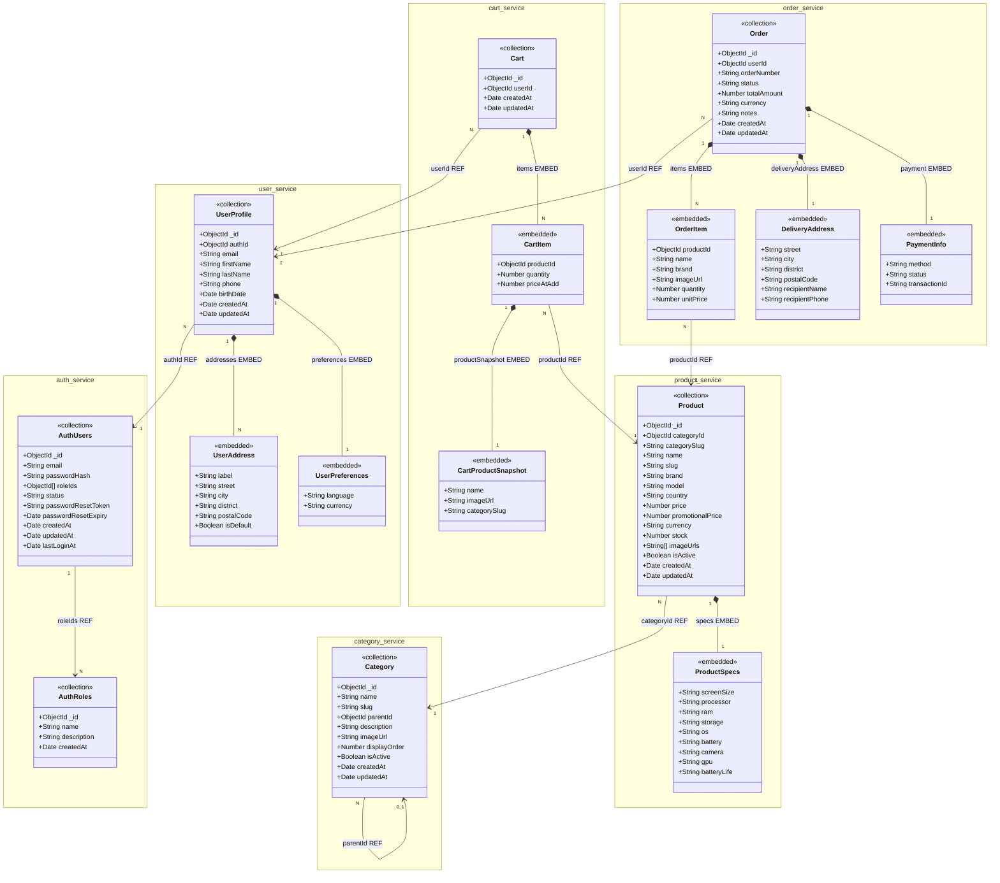

# Diagrama modelului de date

```mermaid
classDiagram
  namespace auth_service {
    class AuthUsers {
      <<collection>>
      +ObjectId _id
      +String email
      +String passwordHash
      +ObjectId[] roleIds
      +String status
      +String passwordResetToken
      +Date passwordResetExpiry
      +Date createdAt
      +Date updatedAt
      +Date lastLoginAt
    }
    class AuthRoles {
      <<collection>>
      +ObjectId _id
      +String name
      +String description
      +Date createdAt
    }
  }

  namespace user_service {
    class UserProfile {
      <<collection>>
      +ObjectId _id
      +ObjectId authId
      +String email
      +String firstName
      +String lastName
      +String phone
      +Date birthDate
      +Date createdAt
      +Date updatedAt
    }
    class UserAddress {
      <<embedded>>
      +String label
      +String street
      +String city
      +String district
      +String postalCode
      +Boolean isDefault
    }
    class UserPreferences {
      <<embedded>>
      +String language
      +String currency
    }
  }

  namespace category_service {
    class Category {
      <<collection>>
      +ObjectId _id
      +String name
      +String slug
      +ObjectId parentId
      +String description
      +String imageUrl
      +Number displayOrder
      +Boolean isActive
      +Date createdAt
      +Date updatedAt
    }
  }

  namespace product_service {
    class Product {
      <<collection>>
      +ObjectId _id
      +ObjectId categoryId
      +String categorySlug
      +String name
      +String slug
      +String brand
      +String model
      +String country
      +Number price
      +Number promotionalPrice
      +String currency
      +Number stock
      +String[] imageUrls
      +Boolean isActive
      +Date createdAt
      +Date updatedAt
    }
    class ProductSpecs {
      <<embedded>>
      +String screenSize
      +String processor
      +String ram
      +String storage
      +String os
      +String battery
      +String camera
      +String gpu
      +String batteryLife
    }
  }

  namespace cart_service {
    class Cart {
      <<collection>>
      +ObjectId _id
      +ObjectId userId
      +Date createdAt
      +Date updatedAt
    }
    class CartItem {
      <<embedded>>
      +ObjectId productId
      +Number quantity
      +Number priceAtAdd
    }
    class CartProductSnapshot {
      <<embedded>>
      +String name
      +String imageUrl
      +String categorySlug
    }
  }

  namespace order_service {
    class Order {
      <<collection>>
      +ObjectId _id
      +ObjectId userId
      +String orderNumber
      +String status
      +Number totalAmount
      +String currency
      +String notes
      +Date createdAt
      +Date updatedAt
    }
    class OrderItem {
      <<embedded>>
      +ObjectId productId
      +String name
      +String brand
      +String imageUrl
      +Number quantity
      +Number unitPrice
    }
    class DeliveryAddress {
      <<embedded>>
      +String street
      +String city
      +String district
      +String postalCode
      +String recipientName
      +String recipientPhone
    }
    class PaymentInfo {
      <<embedded>>
      +String method
      +String status
      +String transactionId
    }
  }

  %% auth-service
  AuthUsers "1" --> "N" AuthRoles : roleIds REF

  %% user-service
  UserProfile "1" *-- "N" UserAddress : addresses EMBED
  UserProfile "1" *-- "1" UserPreferences : preferences EMBED

  %% product-service
  Product "1" *-- "1" ProductSpecs : specs EMBED

  %% cart-service
  Cart "1" *-- "N" CartItem : items EMBED
  CartItem "1" *-- "1" CartProductSnapshot : productSnapshot EMBED

  %% order-service
  Order "1" *-- "N" OrderItem : items EMBED
  Order "1" *-- "1" DeliveryAddress : deliveryAddress EMBED
  Order "1" *-- "1" PaymentInfo : payment EMBED

  %% cross-service references
  UserProfile "N" --> "1" AuthUsers : authId REF
  Category "N" --> "0..1" Category : parentId REF
  Product "N" --> "1" Category : categoryId REF
  Cart "N" --> "1" UserProfile : userId REF
  CartItem "N" --> "1" Product : productId REF
  Order "N" --> "1" UserProfile : userId REF
  OrderItem "N" --> "1" Product : productId REF
```
